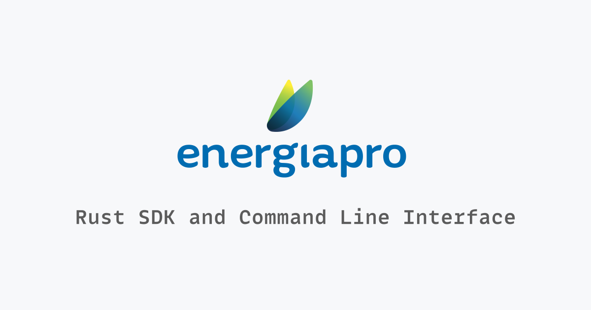

# EnergiaPro Toolkit

A fast Rust toolkit for the [EnergiaPro] API:

- [`energiapro-sdk`](./crates/energiapro-sdk): SDK for seamless API integration
- [`energiapro-cli`](./crates/energiapro-cli): CLI for quick data export and scripting

## CLI

The **CLI** provides a convenient way to interact with the EnergiaPro API without
writing code.

- Fetch installations tied to your account
- Fetch measurements for specific installations
- Output data in `csv`, `json`, `jsonl`, or `parquet` formats

```sh
brew tap nhedger/energiapro
brew install energiapro
```

See the [CLI documentation](./crates/energiapro-cli/README.md) for installation
instructions for other platforms and usage details.

## SDK

The **SDK** allows you to deeply integrate with the EnergiaPro API in your Rust
applications.

- Handles authentication lifecycles and token management
- Provides high-level functions for fetching installations and measurements
- High-level convenience functions for common fetching patterns

```bash
cargo add energiapro
```

See the [SDK documentation](./crates/energiapro-sdk/README.md) for usage details and examples.

## Contributing

Contributions are welcome! Please see the [contributing guidelines] for details
on how to get involved.

[contributing guidelines]: ./CONTRIBUTING.md


## License

This project is licensed under both the MIT License and the Apache License (Version 2.0). See the
[LICENSE-MIT](./LICENSE-MIT) and [LICENSE-APACHE](./LICENSE-APACHE) files for details.

## Trademark

The _EnergiaPro_ name and logo are trademarks of **ENERGIAPRO SA**

This project is an independent open-source SDK/CLI and is not affiliated with, endorsed by, 
or sponsored by **ENERGIAPRO SA**.

[EnergiaPro]: https://www.energiapro.ch